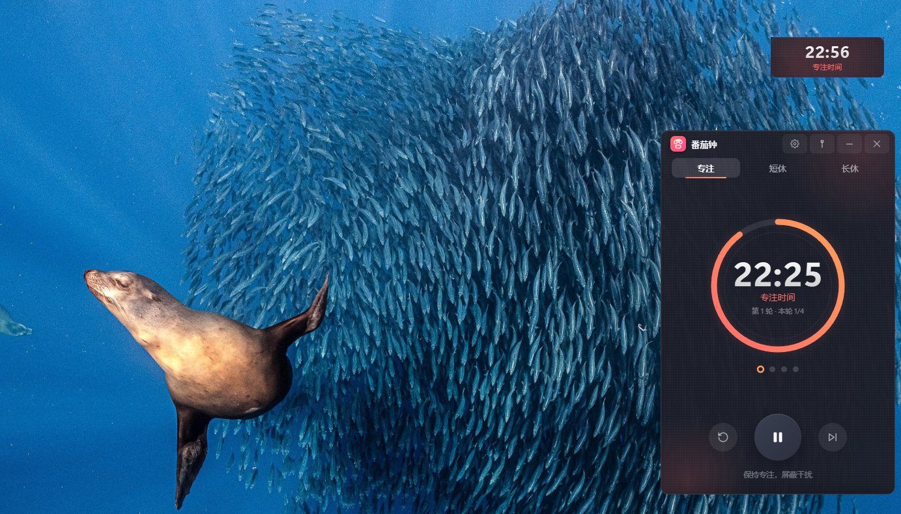

# 🍅 番茄钟 · Pomodoro Fluent

一个符合 **Windows 11 Fluent Design** 设计规范的番茄钟桌面应用，基于 Electron 构建。



  

## ✨ 功能特性

- **⏱️ 番茄钟计时**：专注 25 分钟 / 短休 5 分钟 / 长休 15 分钟，支持自定义时长
- **🔄 自动循环**：专注 → 短休（4 轮后长休）→ 专注，可开启自动进入下一阶段
- **🔔 精美弹窗提醒**：阶段结束时弹出 Win11 风格毛玻璃通知，带动画与进度条；停留 20 秒（鼠标悬停自动暂停倒计时），弹窗里可直接点「进入下一阶段」开跑下一段，不用再回主窗口点开始
- **📌 迷你悬浮窗**：点击图钉收成 176×64 紧凑小窗，只剩时间与阶段文字；悬停时按钮从右侧浮出；置顶显示、自动撤下任务栏图标
- **🧲 贴边隐藏**：迷你小窗拖到屏幕上/下/左/右边缘自动吸附，收起成 6px 进度细条；悬停滑出完整小窗，移开自动收回；多显示器下不串屏
- **🖥️ 后台运行**：关闭窗口最小化到系统托盘，后台持续计时
- **🤖 Agent 集成**：本地 Agent 网关 + hook CLI，Claude Code / OpenCode 需要确认、权限审批或任务完成时弹窗提醒，支持弹窗上直接「允许/拒绝」；统计专注期 agent 工具调用与打断次数，agent 空闲时建议休息（详见 [Agent 集成指南](docs/agent-hooks.md)）
- **🎨 智能配色**：界面配色随阶段变化（专注红 / 短休绿 / 长休蓝）
- **🖱️ 无边框玻璃窗口**：Fluent 圆角卡片，可自由拖动

## 🚀 快速开始

### 环境要求
- Node.js 18+（含 npm）
- Windows 10/11

### 安装与运行

```bash
# 1. 安装 Electron
npm install

# 2. 启动应用
npm start
```

> 💡 若 Electron 二进制下载缓慢，可配置镜像：
> ```bash
> set ELECTRON_MIRROR=https://npmmirror.com/mirrors/electron/
> npm install
> ```

## 🎯 使用说明

| 操作 | 效果 |
|---|---|
| 点击 **▶ 按钮** | 开始 / 暂停计时 |
| 点击 **⏹ 重置** | 重置当前阶段计时，**轮次同时回到第 1 轮 · 本轮 1/N** |
| 点击 **⏭ 跳过** | 跳过当前阶段 |
| 点击 **Tab**（专注/短休/长休） | 手动切换阶段 |
| 点击 **📌 图钉** | 收成迷你悬浮小窗（置顶）；悬停小窗浮出 重置/开始·暂停/跳过 按钮；点时间展开回完整窗口 |
| 拖动迷你小窗**到屏幕边缘** | 贴边吸附，收起成进度细条；悬停细条滑出，拖离边缘取消吸附 |
| 点击 **⚙ 齿轮** | 打开设置（时长 / 自动循环 / Agent 集成） |
| 点击 **🔌 网关图标** | 一键开/关 Agent 网关（绿点=运行中，悬停显示端口）；与设置抽屉里的开关同源 |
| 点击 **— 最小化** | 最小化到系统托盘 |
| 点击 **✕ 关闭** | 隐藏到托盘，后台继续计时 |
| **空格键** | 快速开始/暂停 |
| **R 键** | 快速重置（含轮次） |
| **双击托盘图标** | 显示主窗口（迷你/贴边态会先展开完整窗口） |
| 设置抽屉 → **复制 Hook 配置** | 一键生成 Claude Code hooks 配置片段（含本机 hook 脚本路径） |

### 托盘菜单
右键托盘图标可：显示主窗口 / 开始-暂停 / 重置 / 跳到下一阶段 / 退出。

### 后台运行
应用关闭窗口后不会退出，而是隐藏在系统托盘（任务栏右侧的 🍅 图标），计时继续，到点照常弹窗提醒。**退出请在托盘右键菜单选择「退出」。**

## 🤖 Agent 集成（ZCode / Claude Code / VS Code Copilot / Trae / Cursor / OpenCode / Codex / Qwen Code）

应用运行时会在本地启动一个 **Agent 网关**（默认 `http://127.0.0.1:5277`，仅绑定本机回环地址 + 随机 token 鉴权），让 AI 编程工具与番茄钟联动：

- **提问弹窗（可直接作答）**：agent 的 `AskUserQuestion` 会弹窗列出选项，单选/多选/自定义回答都行，答案直接回传给 agent
- **权限弹窗（可直接审批）**：「允许一次 / 始终允许 / 拒绝」，可填备注作为拒绝理由；「始终允许」会写入对应宿主的权限规则
- **知道是哪个任务在动**：弹窗带上下文——宿主与子 agent 名称、当前任务提示词、工具与命令、项目名、会话尾号（`pomodoro-hook.js sessions` 可查看跟踪明细）
- **通知弹窗**：任务完成、异常等纯通知，看完即走，同样带上下文
- **专注期活动统计**：主窗口显示 `🤖 工具 N · 打断 M`，专注结束弹窗汇总本期 agent 产出
- **休息建议**：agent 跑完任务而你仍在专注时段，弹窗建议趁机休息，一键跳到休息
- **两种「临时关闭」**：右上角 **×** ＝交给终端（回退宿主原生询问）；底部 **暂时收起** ＝挂起，agent 继续等，之后从托盘「待处理的确认」唤回

弹窗会等你 **1 小时**（`POMODORO_TIMEOUT_S` 可调）；到点未决策、或你关窗、或被顶掉，一律回退
**终端原生询问**，绝不静默放行。等待链路是三层嵌套的（番茄钟兜底 3600s < hook 等网关 3900s <
宿主 hook timeout 4200s），顺序乱了就会被宿主提前掐掉——详见
[Agent 集成指南](docs/agent-hooks.md#三层超时谁先到点谁决定结局)。

## 🧠 与 agent 长期记忆的关系

番茄钟**不自建记忆 / 检索 / 存储层**，也不与外部服务打通。长期记忆（偏好依据、踩坑解法、
项目约定）交给 agent 自己的记忆服务（如 OpenViking）：给它一段提示词，让它自己读、自己写，
本项目**一行代码都不参与**。

> 有意不做的三件事：① 不在番茄钟里自建存储 / 检索 / 记忆层；
> ② 不做「专注结束自动写记忆」的开关 —— 那会让番茄钟反向依赖外部服务；
> ③ 不做导出 / 推送 —— 番茄钟对记忆服务的依赖数恒为 0。
> 详见 [长期记忆交给 OpenViking](docs/openviking-memory-prompt.md)。

**一键接入（推荐）**：应用保持运行 → 设置抽屉选好 agent → 点 **一键安装**，配置直接写好（原文件自动备份），面板上会告诉你写了哪些文件、有哪些注意事项；**装失败也不用慌**，面板会给出一模一样的命令行让你复制到终端执行。

也可以走命令行（「复制安装命令」按钮复制的是这条）：

```bash
node "%APPDATA%\番茄钟\hook\pomodoro-hook.js" install --agent all   # 或 zcode / claude / vscode / trae / cursor / opencode / codex / qwen
```

也可以手动粘贴配置片段：Claude Code 在 `~/.claude/settings.json` 的 `hooks` 下；ZCode 在 `~/.zcode/cli/config.json` 的 `hooks.events` 下（需 `"enabled": true`）；**VS Code Copilot** 在 `~/.copilot/hooks/*.json` 或 `.github/hooks/*.json`（格式与 Claude Code 相同，但只有 8 个事件、无 `PermissionRequest`，所以审批挂 `PreToolUse`；且 VS Code **会忽略 matcher**，只拦高风险工具的判断在脚本里做）；**Trae** 在 `%userprofile%/.trae-cn/hooks.json`（Claude Code 那种嵌套格式，6 个事件、有 `Notification` 但无 `PermissionRequest`，审批同样挂 `PreToolUse`；Trae 的 `matcher` 是真生效的，所以先用它收窄）；**Cursor** 在 `~/.cursor/hooks.json`；**Qwen Code** 在 `~/.qwen/settings.json`；OpenCode 走插件；**Codex** 在 `~/.codex/hooks.json`（12 个事件，审批走它自己的 `PermissionRequest` —— 该事件**只在 Codex 本来就要问用户时触发**，比挂在 `PreToolUse` 上精确得多）。

> **Codex 有个反直觉的坑**：它的 `PreToolUse` 只强制执行 `permissionDecision:"deny"`，`"allow"` / `"ask"` 都是「被解析但不生效」。所以番茄钟**不在 Codex 的 `PreToolUse` 上弹窗**（点了「允许」也传不回去，只会被宿主的审批流程再问一次）；审批一律走 `PermissionRequest`。同理 `updatedPermissions` / `updatedInput` / `interrupt` 在 Codex 上会让整条答复 **fail closed**，「始终允许」改由番茄钟本地规则落盘实现。细节见 [`docs/agent-hooks.md`](docs/agent-hooks.md#codex-cli)。

> 挂 `PreToolUse` 的两家（VS Code / Trae）默认**跟随宿主自己的自动允许设置**：读宿主的自动批准配置，命中就不弹窗、也不回决策，交回宿主原本的策略 —— 免得你已经设了自动运行还被反复打断。想查当前判定用 `node pomodoro-hook.js host-perms --source vscode --command "ls -la"`，想关掉跟随设 `POMODORO_RESPECT_HOST_AUTO=0`。细节见 [`docs/agent-hooks.md`](docs/agent-hooks.md#跟不跟随宿主的自动允许)。

> 两个需要留意的点：
> - **VS Code** 默认也会读 `~/.claude/settings.json`，配过 Claude Code 的机器会被跑两遍（且 Claude 那份的 matcher 会被忽略 → 每个工具都触发）。建议在 VS Code 设置里加 `"chat.hookFilesLocations": { "~/.claude/settings.json": false }`。
> - **Trae** 同样会合并 Claude Code 的 hook 配置（官方明说会"合并执行"），而且创建 Hook 时必须选**「本地自动运行」**——沙箱模式限制了系统权限，hook 可能连不上本机网关，表现就是"配了但没弹窗"，连不上时它是静默跳过的。

任意脚本也能直接调用（token 见 `%APPDATA%\番茄钟\gateway.json`）：

```bash
curl -X POST -H "Authorization: Bearer $TOKEN" -H "Content-Type: application/json" \
  -d '{"title":"构建完成","message":"可以回来验收了"}' \
  http://127.0.0.1:5277/api/notify
```

OpenCode 插件接入、远程允许/拒绝、HTTP API 全量说明见 **[Agent 集成指南](docs/agent-hooks.md)**。

## 🛠️ 技术实现

- **主进程**（`main.js`）：窗口管理、系统托盘、通知弹窗、单实例锁
- **Agent 网关**（`gateway.js`）：仅绑定 `127.0.0.1` 回环 + 每次启动随机 token + Host 头校验（防 DNS rebinding）；ask / permission / notification 三类交互经长轮询回传决策；hook CLI（`bin/pomodoro-hook.js`）零依赖，应用未运行时静默退出，绝不阻断 agent
- **一键安装**（`main.js`）：主进程用 Electron 自带的 Node（`ELECTRON_RUN_AS_NODE=1`）跑 hook CLI 写配置，所以本机没装 node 也能装；成败按 CLI 退出码判断（未知宿主 / 写盘失败都非零退出），失败时把等价命令行交还给界面供复制
- **迷你悬浮 & 贴边隐藏**：手动光标跟随拖拽（原生 drag 区会吞掉 `:hover`）；贴边收起时窗口带透明留白绕开 Windows 约 32×39 的最小窗口限制，仅靠屏幕边缘的 6px 绘制进度条，透明区域完全穿透（可见性与点击均不受影响）
- **阶段结束提醒**：弹窗页按 payload 的 `timeoutMs` 决定停留时长（纯通知默认 5s，阶段结束 20s），鼠标悬停暂停倒计时与进度条；弹窗按钮动作回到主进程后转成渲染层命令（`start-next` → 直接开跑下一阶段），网关侧仍是长轮询等决策、与定时器提醒互不干扰
- **渲染进程**（`renderer/`）：Win11 风格 UI + 番茄钟逻辑
- **安全桥接**（`preload.js`）：contextBridge 隔离

### 视觉设计
- **毛玻璃效果**：`backdrop-filter: blur` + 半透明背景（CSS 兜底）
- **系统级 Acrylic 模糊**：通过 Win32 `SetWindowCompositionAttribute`（ACCENT_ENABLE_ACRYLICBLURBEHIND）实现真正的背景模糊（`main.js` 中 `ENABLE_ACRYLIC` 开关，部分 Win10 版本上开启会有卡顿/发白问题，默认关闭，由近实心玻璃卡片兜底）；打包后脚本自动从 asar 解包到用户数据目录执行
- **Fluent 圆角**：主窗口 12px、按钮 7-9px、弹窗 14px；透明窗口只画内容圆角、不画外溢阴影，四角干净
- **自适应配色**：CSS 变量随阶段切换
- **平滑动画**：环形进度、弹性按钮、弹窗入场

## 📦 打包为独立应用

```bash
# 安装打包工具（需要网络，国内可用 npmmirror 加速）
npm i -D electron-builder --registry=https://registry.npmmirror.com

# 打包为便携目录（快速验证，输出 dist/win-unpacked）
npm run pack:dir

# 打包 Windows 安装包（NSIS，输出 dist/Pomodoro-Fluent-Setup-1.0.1.exe）
npm run pack
```

打包产物位于 `dist/` 目录：
- `Pomodoro-Fluent-Setup-1.0.1.exe` —— 安装程序（含桌面/开始菜单快捷方式，可选安装目录；纯英文产物名，GitHub Release 附件名不支持中文）
- `win-unpacked/番茄钟.exe` —— 免安装便携版（直接运行）

> 打包需要联网下载 NSIS 等工具，若速度慢可设置镜像：
> ```bash
> set ELECTRON_MIRROR=https://npmmirror.com/mirrors/electron/
> set ELECTRON_BUILDER_BINARIES_MIRROR=https://npmmirror.com/mirrors/electron-builder-binaries/
> npm run pack
> ```

## 📁 项目结构

```
pomodoro-fluent/
├── main.js              # Electron 主进程
├── preload.js           # 安全桥接层
├── gateway.js           # Agent 网关（本地 HTTP，hooks 对接）
├── bin/
│   └── pomodoro-hook.js # Agent hook CLI（Claude Code / OpenCode / curl）
├── package.json
├── apply-acrylic.ps1    # Acrylic 毛玻璃（DWM API，PowerShell）
├── assets/              # 图标资源（自动生成）
│   ├── icon.png         # 应用/窗口图标
│   └── tray.png         # 托盘图标模板
├── scripts/             # 打包辅助脚本（afterPack）
├── docs/                # 截图与文档（agent-hooks / openviking-memory-prompt）
└── renderer/            # 界面
    ├── index.html       # 主窗口
    ├── styles.css       # 主界面样式（Win11 Fluent）
    ├── app.js           # 番茄钟逻辑
    ├── notify.html      # 通知弹窗（支持 agent 确认模式）
    ├── notify.css       # 弹窗样式
    └── notify.js        # 弹窗逻辑
```

## 📄 许可证

[MIT](LICENSE)
